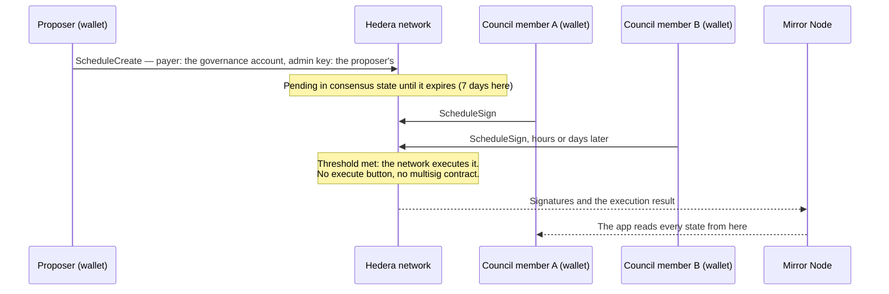

# Hedera Governed Operations

**Multi-sig governance built from Hedera's own primitives.** Treasury moves, contract upgrades and token administration that no single key should run, approved m-of-n by the network itself. The quorum is an account **threshold key**; each proposal is a transaction the **Hedera Schedule Service** holds until the council has signed, and the network runs it the moment the threshold is met — with no multisig contract to deploy, audit or upgrade.

- **Any operation, not one.** Five kinds ship with a form: contract upgrade (UUPS), treasury swap on SaucerSwap, HTS token administration, treasury transfer and council rotation. Contract calls go through a role-gated registry; transfers and rotations are native transactions with no contract in the way.
- **Real wallets, asynchronously.** Council members sign from their own wallets over WalletConnect, days apart, without sharing a machine. What they are asked to approve is decoded into a sentence, read straight from the Mirror Node with no indexer.
- **Plus a co-signing agent.** An optional service that holds one seat, checks each proposal against a written policy and against a release manifest published on HCS, asks a person for a code before an upgrade, and publishes every decision — refusals included — to its own HCS topic. It is one of the n keys, so it can never act alone. See [`packages/agent`](packages/agent/README.md).



### When to use this instead of a Safe

Safe is live on Hedera's EVM and is the right choice for EVM-first teams: 140 Safe proxies were created on Hedera mainnet between 2025-04-09 and 2026-09-29. This template is for teams whose operations are Hedera-native — HBAR and HTS treasuries, contracts they upgrade, keys they rotate — and who want the approval to live in the network itself. That path has had no reference implementation: the whole mainnet created 7.4 scheduled transactions a day in the two weeks to 2026-09-28, and none of them was governance. This template is that implementation.

|                              | Safe on Hedera's EVM                                                                                                                            | Threshold key + Schedule Service                                                                                       |
| ---------------------------- | ----------------------------------------------------------------------------------------------------------------------------------------------- | ---------------------------------------------------------------------------------------------------------------------- |
| What you deploy              | A proxy over a singleton contract: code to audit and a version to track                                                                         | Nothing — the quorum is account state                                                                                  |
| Changing who approves        | A call to the Safe's owner management                                                                                                           | An `AccountUpdate` with the new key, which is itself a proposal both councils sign                                     |
| Where pending approvals wait | Collected off-chain by the [Safe Transaction Service](https://docs.safe.global/core-api/transaction-service-overview) until one transaction submits them | In consensus state until the proposal expires: 7 days here, up to 62 under [HIP-423](https://hips.hedera.com/hip/hip-423) |

One weakness of the native path, said up front: it has no interface of its own. That is why this is a template with an app, not a library.

The figures are a measurement, not a constant, and anyone can repeat it on the mainnet Mirror Node:

```bash
MN=https://mainnet.mirrornode.hedera.com/api/v1
curl -s "$MN/schedules?limit=100&order=desc"                 # volume, creators and memos of recent schedules
curl -s "$MN/contracts/0.0.8923237/results?limit=100&order=asc"  # SafeProxyFactory 1.3.0: follow links.next, count calls to 0x1688f0b9
```

Based on the `hedera-demo` template from [hedera-dev/scaffold-hbar](https://github.com/hedera-dev/scaffold-hbar) (branch `templates/hedera-demo`). General Scaffold-HBAR docs: [Scaffold HBAR on Hedera](https://docs.hedera.com/solutions/tools/scaffold-hbar/index).

## Verified on testnet

Every row is a transaction this repository's code produced on Hedera testnet. Open a link; the right-hand column says what you should see. Checked against the Mirror Node on 2026-09-30.

### This deployment

The demo instance the app reads without a `.env`: the contracts in `packages/nextjs/contracts/deployedContracts.ts` and the ids in `DEMO_INSTANCE` (`packages/nextjs/config/governanceConfig.ts`), plus the agent's decisions topic, which only the agent's own configuration names. Its sources are not verified on Sourcify yet.

| Claim | Proof | What you will see |
| --- | --- | --- |
| The council's quorum is account state, not a contract | [account 0.0.10794626](https://hashscan.io/testnet/account/0.0.10794626) | A threshold key: 2 of 4 — the council account (0.0.10574825), `alice`, `bob` and the co-signing agent (0.0.10794623). The memo still reads "2-of-3", as `yarn setup` wrote it before the agent was seated |
| A proposal is a schedule the governance account pays for | [schedule 0.0.10794949](https://hashscan.io/testnet/schedule/0.0.10794949) | Created by `alice` (0.0.10794621), payer 0.0.10794626, memo "Pay a supplier" |
| The network ran it once the threshold was met; nobody pressed "execute" | same schedule | Two signatures, `alice`'s and `bob`'s; the scheduled `CRYPTOTRANSFER` is `SUCCESS`, 2.5 ℏ to 0.0.10794946 |
| A treasury swap on SaucerSwap runs through an approved proposal | [schedule 0.0.10794955](https://hashscan.io/testnet/schedule/0.0.10794955) | Memo "Sell treasury HBAR for USDC"; the scheduled `CONTRACTCALL` to the executor is `SUCCESS`, and USDC (0.0.5449) reaches the governance account |
| A scheduled call pays its whole gas limit | same schedule | 0.327 ℏ = 300,000 × 109 tinybar, while consuming 247,107 |
| Changing who approves is itself a proposal | [schedule 0.0.10794960](https://hashscan.io/testnet/schedule/0.0.10794960) | Memo "Change the council", signed by `alice` and `bob`; the scheduled `CRYPTOUPDATEACCOUNT` is `SUCCESS`, and it is what turned the 2-of-3 key into the 2-of-4 above, seating the agent (0.0.10794623) |
| A token the council governs but cannot sign for | [token 0.0.10794655](https://hashscan.io/testnet/token/0.0.10794655) | No admin or supply key; its pause and freeze keys are contract 0.0.10794649 (`TokenAdmin`), for good |
| Releases and the agent's decisions have topics only their writers can post to | [topic 0.0.10794624](https://hashscan.io/testnet/topic/0.0.10794624) (releases), [topic 0.0.10794625](https://hashscan.io/testnet/topic/0.0.10794625) (the agent's decisions) | Each with a submit key; the decisions topic is the agent's because its submit key is the key of the agent account 0.0.10794623. Both are still empty: no release has been published and the agent has not run against this deployment |

### An earlier deployment of the same contract code

What has not been run again on the deployment above. Since then `SaucerSwapAdapter` has gained comments, not code. Its governance account is [0.0.10671146](https://hashscan.io/testnet/account/0.0.10671146), a 2-of-3 threshold key.

| Claim | Proof | What you will see |
| --- | --- | --- |
| An upgrade is a proposal the network executes | [schedule 0.0.10716564](https://hashscan.io/testnet/schedule/0.0.10716564) | Payer 0.0.10671146, memo "upgrade at 150000 gas"; the scheduled `CONTRACTCALL` is `SUCCESS`, and the vault proxy emitted `Upgraded` naming `AcmeVaultV2`. It paid 0.1635 ℏ = 150,000 × 109 tinybar, while consuming 65,410 |
| A proposer can withdraw a round | [schedule 0.0.10714416](https://hashscan.io/testnet/schedule/0.0.10714416) | Deleted, never executed |
| Executed is not succeeded | [schedule 0.0.10765677](https://hashscan.io/testnet/schedule/0.0.10765677), then [0.0.10766696](https://hashscan.io/testnet/schedule/0.0.10766696) | The same treasury swap on SaucerSwap: `CONTRACT_REVERT_EXECUTED`, then `SUCCESS` once `yarn setup` associated the output token with the treasury |
| Releases are published where only the team can write | [topic 0.0.10760100](https://hashscan.io/testnet/topic/0.0.10760100) | A submit key, and the `v2.0.0` manifest with the hash of the deployed runtime bytecode |
| The agent's decisions are public, refusals included | [topic 0.0.10762625](https://hashscan.io/testnet/topic/0.0.10762625) | The agent's own submit key; approvals, an upgrade held `pending` until a person's code, and a refusal naming the limit it failed |
| The agent is one seat, not the owner: its signature plus a member's runs the proposal | [schedule 0.0.10781952](https://hashscan.io/testnet/schedule/0.0.10781952) | The agent's approval as message 11 on the topic above, then a second council signature; the scheduled `CRYPTOTRANSFER` is `SUCCESS`, 0.05 ℏ to 0.0.10671142 |

You do not have to trust this page — read the ledger:

```bash
curl -s https://testnet.mirrornode.hedera.com/api/v1/schedules/0.0.10794955 \
  | jq '{payer_account_id, executed_timestamp, signatures: (.signatures | length)}'
```

## Quick start

### Prerequisites

- Node.js ≥ 20.18.3, Git
- Yarn (this template is Yarn-only)
- A Hedera **testnet** account with HBAR — create and fund it at [portal.hedera.com](https://portal.hedera.com)
- A [WalletConnect project ID](https://cloud.reown.com) (Reown / WalletConnect Cloud)
- A WalletConnect wallet with a testnet account, to sign from the browser: [HashPack](https://www.hashpack.app/) or [Kabila](https://www.kabila.app). Withdrawing a proposal, and cancelling one whose approval round is still open, needs Kabila: HashPack does not sign a `ScheduleDelete`

### Create, configure, run

```bash
npm create scaffold-hbar@latest -- --template SpaceUY/hedera-governed-operations
cd <your-project>
yarn install

cp packages/nextjs/.env.example packages/nextjs/.env
# Fill in HEDERA_OPERATOR_ID, HEDERA_OPERATOR_PRIVATE_KEY, HEDERA_COUNCIL_ACCOUNT_ID
# and NEXT_PUBLIC_WALLET_CONNECT_PROJECT_ID

yarn setup                                   # testnet resources; stops once the contracts are the next step
yarn hardhat:deploy --network hederaTestnet  # see Contracts below for the deployer account
yarn setup                                   # demo token and the first proposal
yarn next:dev                                # http://localhost:3000
```

`yarn setup` creates the agent's release and decision HCS topics, three funded ECDSA demo accounts associated with testnet USDC (`0.0.5449`) — `alice` and `bob`, and `agent` for the co-signing agent — and the governance account: a 2-of-3 threshold key over your own account (`HEDERA_COUNCIL_ACCOUNT_ID`), `alice` and `bob`. The agent starts outside the council; seating it is a proposal the council approves ("Add the co-signing agent"). Every id lands in `packages/nextjs/.env.local`.

To look around first, `yarn install && yarn next:dev` needs no `.env`, wallet or funded account: until `yarn setup` has written its ids, the app reads the template's public demo instance on testnet (live Mirror Node data) and says so on screen.

It runs on either side of the deploy because the dependency is circular: the contracts are deployed against the governance account, so it has to exist first, and the demo token's pause and freeze keys are `TokenAdmin`'s contract id, which a token created without an admin key can never change — so the contract has to exist before the token. The first run hands the deploy the two values it needs through `packages/hardhat/.env`; the second creates the token and leaves one proposal pending for the council to approve. [The runbook](docs/RUNBOOK.md) walks all three steps.

It is idempotent: ids are kept in `packages/nextjs/setup-state.json` (gitignored, holds the demo keys), verified against the network on every run, and only missing pieces are created — a third run creates nothing. It refuses `HEDERA_NETWORK=mainnet`. Product-specific fixtures plug into the hooks in `packages/nextjs/scripts/setup/extensions.ts`.

### Contracts

`packages/hardhat` targets the Hedera JSON-RPC relay (`hederaTestnet`, chain 296) and ships the five contracts this template governs:

| Contract            | What it is                                                                                     |
| ------------------- | ---------------------------------------------------------------------------------------------- |
| `GovernedExecutor`  | The proposal registry. Proposing is a role; executing takes the council's m-of-n approval      |
| `AcmeVault`         | Upgradeable vault behind a UUPS proxy; its upgrades are the operation the council approves     |
| `AcmeVaultV2`       | The implementation that upgrade points the proxy at — it is what unlocks withdrawals           |
| `TokenAdmin`        | Holds the demo token's pause and freeze keys, and accepts calls only from the executor         |
| `SaucerSwapAdapter` | Swaps treasury HBAR on SaucerSwap V2, again only when reached through an approved proposal     |

Add yours under `contracts/` with a matching script under `deploy/`.

```bash
yarn hardhat:account:generate          # encrypted deployer key in packages/hardhat/.env, then fund it at the faucet
yarn hardhat:deploy --network hederaTestnet
yarn hardhat:verify:testnet            # Sourcify, prints the HashScan link for each contract
```

Every deploy regenerates `packages/nextjs/contracts/deployedContracts.ts` with the addresses and ABIs the frontend reads. See `packages/hardhat/README.md` for the local forked node and the mainnet commands.

## What's inside

### Compared with the official starters

|                    | `blank`                 | `hedera-demo`              | **this template**                                                            |
| ------------------ | ----------------------- | -------------------------- | ---------------------------------------------------------------------------- |
| Solidity workspace | yes (Hardhat / Foundry) | no                         | yes (Hardhat)                                                                |
| Wallet             | EVM (wagmi)             | HashPack via WalletConnect | WalletConnect (HashPack, Kabila), reusable signer with sign-only and batch helpers |
| Reads              | JSON-RPC                | Mirror Node API routes     | typed Mirror Node client + React Query hooks                                 |
| Swaps              | —                       | —                          | `SwapProvider` interface with a SaucerSwap V2 implementation                 |
| Testnet setup      | manual                  | manual (`/admin` page)     | `yarn setup` (idempotent, writes `.env.local`)                               |
| Harness recipe     | —                       | —                          | `.harness/` with ASSERT, SMOKE and EVALUATE stages                           |

### Routes

| Route                      | Purpose                                                                                                   |
| -------------------------- | --------------------------------------------------------------------------------------------------------- |
| `/`                        | Live map — treasury figures and the council's threshold beside a rail of pending and recent proposals     |
| `/governance/[scheduleId]` | One proposal: the decoded operation, its approvals, and Sign / Withdraw / Cancel (wallet-signed)          |
| `/governance/new`          | Open a proposal: pick an operation, preview what the council will see, submit it (wallet-signed)          |

### Modules

| Module             | Path (under `packages/nextjs/`)                             | What it gives you                                                                                           |
| ------------------ | ----------------------------------------------------------- | ----------------------------------------------------------------------------------------------------------- |
| Wallet signer      | `services/web3/hederaSigner.ts`, `hooks/useHederaSigner.ts` | HashPack session via WalletConnect, sign-and-execute, sign-only and HIP-551 batch inner-transaction helpers |
| Mirror Node client | `hooks/mirror/*` (client: `@sh/core/mirror`)                | Typed REST client and React Query hooks for topics, accounts, tokens and transactions                       |
| Swap provider      | `services/swap/*`                                           | `SwapProvider` interface with a SaucerSwap V2 implementation and on-chain quoting                           |
| Setup script       | `yarn setup`                                                | Idempotent testnet bootstrap that writes `.env.local`                                                       |
| Harness recipe     | `.harness/`                                                 | Static, command, smoke and semantic checks for the template                                                 |
| Contracts          | `packages/hardhat/`                                         | Hardhat on the Hedera JSON-RPC relay, deploys that regenerate `contracts/deployedContracts.ts`, Sourcify verification |

## Scripts

| Command                        | Description                                                                          |
| ------------------------------ | ------------------------------------------------------------------------------------ |
| `yarn setup`                   | Create missing testnet resources and write their ids to `packages/nextjs/.env.local` |
| `yarn next:dev`                | Dev server at http://localhost:3000                                                  |
| `yarn next:build`              | Production build                                                                     |
| `yarn next:check-types`        | TypeScript check                                                                     |
| `yarn lint` / `yarn next:lint` | ESLint                                                                               |
| `yarn test`                    | Unit tests (Vitest)                                                                  |
| `yarn format`                  | Prettier                                                                             |
| `yarn gate`                    | Gate a fresh clone must pass, no credentials: secrets scan, install, lint, types, tests, build, `hedera-harness validate`. Refuses to run while a `.env` exists |
| `yarn harness:run`             | Full Hedera Harness loop (generate, validate, repair)                                |
| `yarn harness:council-seat`    | Seats the harness test signer on the council; run by the harness, not by hand        |
| `yarn hardhat:compile`         | Compile the contracts under `packages/hardhat/contracts/`                            |
| `yarn hardhat:test`            | Contract tests                                                                       |
| `yarn hardhat:account:generate`| Create an encrypted deployer key in `packages/hardhat/.env`                          |
| `yarn hardhat:deploy`          | Deploy and regenerate `packages/nextjs/contracts/deployedContracts.ts`               |
| `yarn hardhat:verify:testnet`  | Verify the testnet deployments on Sourcify and print their HashScan links            |

## Validate with Hedera Harness

The template ships a [Hedera Harness](https://github.com/hedera-dev/hedera-harness) recipe under `.harness/` (`hedera-harness` is pinned to `2.0.0-rc.4`, schema v3). It checks that a fresh scaffold installs, lints, builds and boots, and then grades the running app against `.harness/eval.json` — five assertions, four of which read the app without a wallet and one of which **approves a real proposal on testnet**. The recipe assumes Yarn; if you scaffolded with npm, adjust the commands in `.harness/validators/yarn.json` and `.harness/spec.yaml`.

```bash
npx hedera-harness doctor             # preflight: node, git, recipe, agent CLI, browser
npx hedera-harness validate           # ASSERT + SMOKE: static checks, yarn install/lint/test/build, routes boot
npx hedera-harness validate-semantic  # EVALUATE + CHAIN: a Claude Code session browses the app and grades eval.json
yarn harness:run                      # full loop: generate from .harness/prd.md, then validate and repair
```

**What each stage needs is very different**, and getting that wrong is the usual reason a run fails for reasons unrelated to the app:

| Stage | Credentials | Other |
| ----- | ----------- | ----- |
| `validate` | none | No `.env` inside the tree — the static validator forbids it. CI runs this on every pull request |
| `validate-semantic` | `HEDERA_OPERATOR_ID` and `HEDERA_OPERATOR_PRIVATE_KEY` **exported in the shell** (the harness never reads `.env`) | The `claude` CLI authenticated, Chrome or Playwright Chromium, and a workspace where `yarn setup` and the deploy have already run. With no `.env` the app browses the demo instance, so four assertions pass and E9, which seats the run's signer on your council, fails |

```bash
export HEDERA_OPERATOR_ID=0.0.xxxxx
export HEDERA_OPERATOR_PRIVATE_KEY=<ECDSA private key>   # bare value: an inline comment makes the harness reject and echo it
npx hedera-harness validate-semantic
```

The CHAIN stage provisions a funded, disposable testnet account and hands its key to the app as `localStorage["burnerWallet.pk"]`, so wallet-gated assertions run end to end. The app treats that key as a **test signer** (`packages/nextjs/services/web3/burnerSigner.ts`): testnet only, active in dev builds, opt-in for production with `NEXT_PUBLIC_ENABLE_BURNER_SIGNER=true`. Without the key, HashPack is used as usual.

Paying for a transaction is not the same as approving one, though. A `ScheduleSign` only counts towards the threshold if the key sits in the governance account's threshold key, so `yarn harness:council-seat` runs in front of the dev server and gives that run's signer a seat — rebuilding the key from the three configured members plus the signer (and the co-signing agent, if the council has seated it), so seats never accumulate. That is what lets the last assertion grade an approval reaching the ledger instead of a button being enabled. It needs the demo members' keys from the gitignored `setup-state.json`, which is why that stage expects a workspace that has already been set up.

[The runbook](docs/RUNBOOK.md#6-validate-with-hedera-harness) has the rest: why the seat lives in the server command rather than in `chainValidation.deploy`, what a run leaves behind on testnet and how to undo it, and a troubleshooting table.

## Docs

- [Architecture](docs/ARCHITECTURE.md) — signing flows, module map, verified network constraints
- [Runbook](docs/RUNBOOK.md) — step-by-step reproduction on testnet, harness stages, troubleshooting
- [Glossary](docs/GLOSSARY.md) — Hedera terms as used in this template
- [AGENTS.md](AGENTS.md) — briefing for coding agents (Cursor, Claude Code, Codex)

## Links

- [Scaffold HBAR docs](https://docs.hedera.com/solutions/tools/scaffold-hbar/index)
- [create-scaffold-hbar](https://github.com/hedera-dev/create-scaffold-hbar) — CLI
- [Hedera docs](https://docs.hedera.com/)
- [HashScan testnet](https://hashscan.io/testnet)

## Disclaimer

Experimental software: not audited, testnet first. Review every module before using it with mainnet funds.

## Licence

MIT — see [LICENCE](LICENCE).
