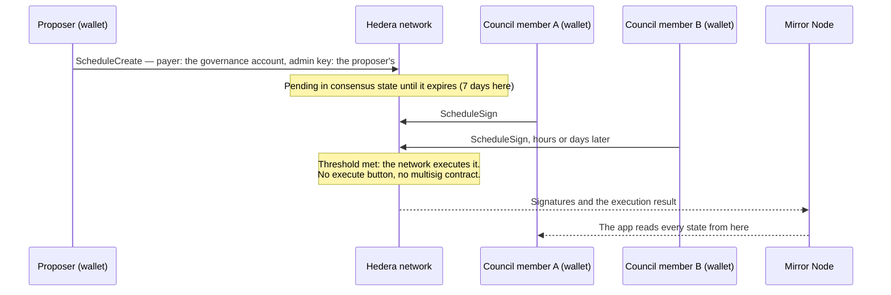

# Hedera Governed Operations

**Multi-sig governance built from Hedera's own primitives.** Treasury moves, contract upgrades and token administration that no single key should run, approved m-of-n by the network itself. The quorum is an account **threshold key**; each proposal is a transaction the **Hedera Schedule Service** holds until the council has signed, and the network runs it the moment the threshold is met — with no multisig contract to deploy, audit or upgrade.

- **Any operation, not one.** Five kinds ship with a form: contract upgrade (UUPS), treasury swap on SaucerSwap, HTS token administration, treasury transfer and council rotation. Contract calls go through a role-gated registry; transfers and rotations are native transactions with no contract in the way.
- **Real wallets, asynchronously.** Council members sign from their own wallets over WalletConnect, days apart, without sharing a machine. What they are asked to approve is decoded into a sentence, read straight from the Mirror Node with no indexer.
- **Plus a co-signing agent.** An optional service that holds one seat, checks each proposal against a written policy and against a release manifest published on HCS, asks a person for a code before an upgrade, and publishes every decision — refusals included — to its own HCS topic. It is one of the n keys, so it can never act alone. See [`packages/agent`](packages/agent/README.md).




### When to use this instead of a Safe

Safe is live on Hedera's EVM and is the right choice for EVM-first teams: 140 Safe proxies were created on Hedera mainnet between 2025-04-09 and 2026-09-29. This template is for teams whose operations are Hedera-native — HBAR and HTS treasuries, contracts they upgrade, keys they rotate — and who want the approval to live in the network itself. That path has had no reference implementation: the whole mainnet created 7.4 scheduled transactions a day in the two weeks to 2026-09-28, and none of them was governance. This template is that implementation.

|                              | Safe on Hedera's EVM                                                                                                                            | Threshold key + Schedule Service                                                                                       |
| ---------------------------- | ----------------------------------------------------------------------------------------------------------------------------------------------- | ---------------------------------------------------------------------------------------------------------------------- |
| What you deploy              | A proxy over a singleton contract: code to audit and a version to track                                                                         | Nothing — the quorum is account state                                                                                  |
| Changing who approves        | A call to the Safe's owner management                                                                                                           | An `AccountUpdate` with the new key, which is itself a proposal both councils sign                                     |
| Where pending approvals wait | Collected off-chain by the [Safe Transaction Service](https://docs.safe.global/core-api/transaction-service-overview) until one transaction submits them | In consensus state until the proposal expires: 7 days here, up to 62 under [HIP-423](https://hips.hedera.com/hip/hip-423) |

One weakness of the native path, said up front: it has no interface of its own. That is why this is a template with an app, not a library.

The figures are a measurement, not a constant, and anyone can repeat it on the mainnet Mirror Node:

```bash
MN=https://mainnet.mirrornode.hedera.com/api/v1
curl -s "$MN/schedules?limit=100&order=desc"                 # volume, creators and memos of recent schedules
curl -s "$MN/contracts/0.0.8923237/results?limit=100&order=asc"  # SafeProxyFactory 1.3.0: follow links.next, count calls to 0x1688f0b9
```

Based on the `hedera-demo` template from [hedera-dev/scaffold-hbar](https://github.com/hedera-dev/scaffold-hbar) (branch `templates/hedera-demo`). General Scaffold-HBAR docs: [Scaffold HBAR on Hedera](https://docs.hedera.com/solutions/tools/scaffold-hbar/index).

## Contents

1. [Verified on testnet](#verified-on-testnet) — the claims above, as transactions
2. [Eight traps](#eight-traps-and-what-each-one-costs-you) — and where the code handles each
3. [Quick start](#quick-start) — scaffold, set up, deploy, run
4. [What's inside](#whats-inside) — starters compared, routes
5. [Use cases and customization](#use-cases-and-customization) — councils and what you change
6. [Scripts](#scripts)
7. [Validate with Hedera Harness](#validate-with-hedera-harness) — what each stage needs
8. [What this does not do](#what-this-does-not-do) — trust assumptions, limits, wallets
9. [Docs](#docs)

## Verified on testnet

Every row is a transaction this repository's code produced on Hedera testnet. Open a link; the right-hand column says what you should see. Checked against the Mirror Node on 2026-10-01.

### This deployment

The demo instance the app reads without a `.env`: the contracts in `packages/nextjs/contracts/deployedContracts.ts` and the ids in `DEMO_INSTANCE` (`packages/nextjs/config/governanceConfig.ts`), plus the agent's decisions topic, which only the agent's own configuration names. All six of its contracts are source-verified on Sourcify.

| Claim | Proof | What you will see |
| --- | --- | --- |
| The council's quorum is account state, not a contract | [account 0.0.10794626](https://hashscan.io/testnet/account/0.0.10794626) | A threshold key: 2 of 4 — the council account (0.0.10574825), `alice`, `bob` and the co-signing agent (0.0.10794623). The memo reads "scaffold-hbar governance 2-of-4" |
| A proposal is a schedule the governance account pays for | [schedule 0.0.10794949](https://hashscan.io/testnet/schedule/0.0.10794949) | Created by `alice` (0.0.10794621), payer 0.0.10794626, memo "Pay a supplier" |
| The network ran it once the threshold was met; nobody pressed "execute" | same schedule | Two signatures, `alice`'s and `bob`'s; the scheduled `CRYPTOTRANSFER` is `SUCCESS`, 2.5 ℏ to 0.0.10794946 |
| A treasury swap on SaucerSwap runs through an approved proposal | [schedule 0.0.10794955](https://hashscan.io/testnet/schedule/0.0.10794955) | Memo "Sell treasury HBAR for USDC"; the scheduled `CONTRACTCALL` to the executor is `SUCCESS`, and USDC (0.0.5449) reaches the governance account |
| A scheduled call pays its whole gas limit | same schedule | 0.327 ℏ = 300,000 × 109 tinybar, while consuming 247,107 |
| Changing who approves is itself a proposal | [schedule 0.0.10794960](https://hashscan.io/testnet/schedule/0.0.10794960) | Memo "Change the council", signed by `alice` and `bob`; the scheduled `CRYPTOUPDATEACCOUNT` is `SUCCESS`, and it is what turned the 2-of-3 key into the 2-of-4 above, seating the agent (0.0.10794623) |
| The deployed bytecode is this repository's source | [GovernedExecutor](https://sourcify.dev/server/v2/contract/296/0xE3E24BeF0903e68e584E3a93e5F0b746959f4C7C), [AcmeVault proxy](https://sourcify.dev/server/v2/contract/296/0xeA63e5b8eF5B0eC87a6236a557bBc447E948De63), [AcmeVault implementation](https://sourcify.dev/server/v2/contract/296/0x4Dd56b18EAA0e0a18B1928b7588859e1e7B0C163), [AcmeVaultV2](https://sourcify.dev/server/v2/contract/296/0x54d742A00c50536e4FaC4a3849771A2468F12418), [SaucerSwapAdapter](https://sourcify.dev/server/v2/contract/296/0x6405578Fd89C36756C805346EBeba46e146d5202), [TokenAdmin](https://sourcify.dev/server/v2/contract/296/0x41d9344a909F0DE9135b89A1a922749874D4eACC) | `"match": "exact_match"` on chain 296: the runtime bytecode matches exactly (`runtimeMatch`); the creation bytecode has no result (`creationMatch: null`) |
| A token the council governs but cannot sign for | [token 0.0.10794655](https://hashscan.io/testnet/token/0.0.10794655) | No admin or supply key; its pause and freeze keys are contract 0.0.10794649 (`TokenAdmin`), for good |
| Releases and the agent's decisions have topics only their writers can post to | [topic 0.0.10794624](https://hashscan.io/testnet/topic/0.0.10794624) (releases), [topic 0.0.10794625](https://hashscan.io/testnet/topic/0.0.10794625) (the agent's decisions) | Each with a submit key; the decisions topic is the agent's because its submit key is the key of the agent account 0.0.10794623. The releases topic carries the `v2.0.0` manifest with the hash of `AcmeVaultV2`'s runtime bytecode |
| The agent is one seat, not the owner: its signature plus a member's runs the proposal | [schedule 0.0.10797084](https://hashscan.io/testnet/schedule/0.0.10797084) | Signed by `alice`, then by the agent, whose approval is message 1 on the decisions topic; the scheduled `CRYPTOTRANSFER` is `SUCCESS`, 0.5 ℏ to 0.0.10794946 |

### An earlier deployment of the same contract code

What has not been run again on the deployment above. Its governance account is [0.0.10671146](https://hashscan.io/testnet/account/0.0.10671146), a 2-of-3 threshold key. Since then `SaucerSwapAdapter` has gained comments, not code.

| Claim | Proof | What you will see |
| --- | --- | --- |
| An upgrade is a proposal the network executes | [schedule 0.0.10716564](https://hashscan.io/testnet/schedule/0.0.10716564) | Payer 0.0.10671146, memo "upgrade at 150000 gas"; the scheduled `CONTRACTCALL` is `SUCCESS`, and the vault proxy emitted `Upgraded` naming `AcmeVaultV2`. It paid 0.1635 ℏ = 150,000 × 109 tinybar, while consuming 65,410 |
| A proposer can withdraw a round | [schedule 0.0.10714416](https://hashscan.io/testnet/schedule/0.0.10714416) | Deleted, never executed |
| Executed is not succeeded | [schedule 0.0.10765677](https://hashscan.io/testnet/schedule/0.0.10765677), then [0.0.10766696](https://hashscan.io/testnet/schedule/0.0.10766696) | The same treasury swap on SaucerSwap: `CONTRACT_REVERT_EXECUTED`, then `SUCCESS` once `yarn setup` associated the output token with the treasury |
| The agent's decisions are public, refusals included | [topic 0.0.10762625](https://hashscan.io/testnet/topic/0.0.10762625) | The agent's own submit key; approvals, an upgrade held `pending` until a person's code, and a refusal naming the limit it failed |

You do not have to trust this page — read the ledger:

```bash
curl -s https://testnet.mirrornode.hedera.com/api/v1/schedules/0.0.10794955 \
  | jq '{payer_account_id, executed_timestamp, signatures: (.signatures | length)}'
```

## Eight traps, and what each one costs you

The costliest of the [verified traps in `AGENTS.md`](AGENTS.md#verified-traps), which has the rest and the measurements. Only trap 1 links the deployment above; the other links come from an earlier deployment of the same contracts or from proof-of-concept runs, and what they show does not depend on the deployment.

| # | Trap | What you'd write | What actually happens | Where it's handled |
| --- | --- | --- | --- | --- |
| 1 | Gas is a price | A generous limit on a scheduled call | You pay the whole limit, used or not: 0.327 ℏ for 300,000, 247,107 consumed ([0.0.10794955](https://hashscan.io/testnet/schedule/0.0.10794955)) | One measured limit per kind, `PROPOSAL_TYPES` |
| 2 | Association charged as gas | Rely on automatic associations for a swap's output token | The swap reverts with `TransferFail(21)`: fee paid, and the council signs again ([0.0.10765677](https://hashscan.io/testnet/schedule/0.0.10765677); associated: [0.0.10766696](https://hashscan.io/testnet/schedule/0.0.10766696)) | `yarn setup` associates it first (`packages/nextjs/scripts/setup/treasuryAssociation.ts`) |
| 3 | m-of-n ≠ `signatures.length` | `signatures.length >= threshold` | Wrong progress shown: payers get rows, so an executed 2-of-3 shows four ([0.0.10716564](https://hashscan.io/testnet/schedule/0.0.10716564)) | `countThresholdSignatures` counts members |
| 4 | Token key = contract id | A scheduled `TokenPause` | The council cannot govern the token: `SCHEDULED_TRANSACTION_NOT_IN_WHITELIST` ([tx](https://hashscan.io/testnet/transaction/1789669916.603630104)) | Pause and freeze keys are `TokenAdmin`'s id (`packages/nextjs/scripts/setup/hederaGovernance.ts`) |
| 5 | Executed ≠ succeeded | `executed_timestamp` means it worked | A failed proposal shown as done: reverts execute too ([0.0.10670585](https://hashscan.io/testnet/schedule/0.0.10670585): `CONTRACT_REVERT_EXECUTED`) | `fetchScheduleExecution` reads the scheduled row |
| 6 | Aliased holder | Freeze by long-zero address | Fee paid, nothing frozen: reverts with `HtsRejected(15)`, HTS's `INVALID_ACCOUNT_ID` ([tx](https://hashscan.io/testnet/transaction/1790713623.226064483)) | `draftTokenAdmin` uses Mirror's `evm_address` |
| 7 | No admin key | `ScheduleCreate` without `setAdminKey` | A proposal nobody can withdraw: `SCHEDULE_IS_IMMUTABLE` ([tx](https://hashscan.io/testnet/transaction/1790341670.244801104)); it waits out its expiry | The proposer's key is the admin key (`useCreateProposal`) |
| 8 | Empty `bytecode` | Hash `bytecode` from `GET /contracts/{id}` | A release check that proves nothing: relay deploys report `"0x"`; the code is in `runtime_bytecode` | `yarn release:publish` and `checkImplementationAgainstManifest` |

## Quick start

### Prerequisites

- Node.js ≥ 20.18.3, Git
- Yarn (this template is Yarn-only)
- A Hedera **testnet** account with HBAR — create and fund it at [portal.hedera.com](https://portal.hedera.com)
- A [WalletConnect project ID](https://cloud.reown.com) (Reown / WalletConnect Cloud)
- A WalletConnect wallet with a testnet account, to sign from the browser: [HashPack](https://www.hashpack.app/) or [Kabila](https://www.kabila.app). Withdrawing, or cancelling an open round, needs Kabila ([why](#wallets))

### Create, configure, run

```bash
npm create scaffold-hbar@latest -- --template SpaceUY/hedera-governed-operations
cd <your-project>
yarn install

cp packages/nextjs/.env.example packages/nextjs/.env
# Fill in HEDERA_OPERATOR_ID, HEDERA_OPERATOR_PRIVATE_KEY, HEDERA_COUNCIL_ACCOUNT_ID
# and NEXT_PUBLIC_WALLET_CONNECT_PROJECT_ID

yarn setup                                   # testnet resources; stops once the contracts are the next step
yarn hardhat:account:generate                # deployer key; fund it at the faucet before deploying
yarn hardhat:deploy --network hederaTestnet  # see Contracts below
yarn setup                                   # demo token and the first proposal
yarn next:dev                                # http://localhost:3000
```

`yarn setup` creates the agent's release and decision HCS topics, three funded ECDSA demo accounts associated with testnet USDC (`0.0.5449`) — `alice` and `bob`, and `agent` for the co-signing agent — and the governance account: a 2-of-3 threshold key over your own account (`HEDERA_COUNCIL_ACCOUNT_ID`), `alice` and `bob`. The agent starts outside the council; seating it is a proposal the council approves ("Add the co-signing agent"). Every id lands in `packages/nextjs/.env.local`.

It runs on either side of the deploy because the dependency is circular: the contracts are deployed against the governance account, so it has to exist first, and the demo token's pause and freeze keys are `TokenAdmin`'s contract id, which a token created without an admin key can never change — so the contract has to exist before the token. The first run hands the deploy the two values it needs through `packages/hardhat/.env`; the second creates the token and leaves one proposal pending for the council to approve. [The runbook](docs/RUNBOOK.md) walks all three steps.

It is idempotent: ids are kept in `packages/nextjs/setup-state.json` (gitignored, holds the demo keys), verified against the network on every run, and only missing pieces are created — a third run creates nothing. It refuses `HEDERA_NETWORK=mainnet`. Product-specific fixtures plug into the hooks in `packages/nextjs/scripts/setup/extensions.ts`.

### Contracts

`packages/hardhat` targets the Hedera JSON-RPC relay (`hederaTestnet`, chain 296) and ships the five contracts this template governs:

| Contract            | What it is                                                                                     |
| ------------------- | ---------------------------------------------------------------------------------------------- |
| `GovernedExecutor`  | The proposal registry. Proposing is a role; executing takes the council's m-of-n approval      |
| `AcmeVault`         | Upgradeable vault behind a UUPS proxy; its upgrades are the operation the council approves     |
| `AcmeVaultV2`       | The implementation that upgrade points the proxy at — it is what unlocks withdrawals           |
| `TokenAdmin`        | Holds the demo token's pause and freeze keys, and accepts calls only from the executor         |
| `SaucerSwapAdapter` | Swaps treasury HBAR on SaucerSwap V2, again only when reached through an approved proposal     |

Add yours under `contracts/` with a matching script under `deploy/`.

```bash
yarn hardhat:account:generate          # encrypted deployer key in packages/hardhat/.env, then fund it at the faucet
yarn hardhat:deploy --network hederaTestnet
yarn hardhat:verify:testnet            # Sourcify, prints the HashScan link for each contract
```

Every deploy regenerates `packages/nextjs/contracts/deployedContracts.ts` with the addresses and ABIs the frontend reads. See `packages/hardhat/README.md` for the local forked node and the mainnet commands.

## What's inside

### Compared with the official starters

|                    | `blank`                 | `hedera-demo`              | **this template**                                                            |
| ------------------ | ----------------------- | -------------------------- | ---------------------------------------------------------------------------- |
| Solidity workspace | yes (Hardhat / Foundry) | no                         | yes (Hardhat)                                                                |
| Wallet             | EVM (wagmi)             | HashPack via WalletConnect | WalletConnect (HashPack, Kabila), reusable signer with a sign-only helper |
| Reads              | JSON-RPC                | Mirror Node API routes     | typed Mirror Node client + React Query hooks                                 |
| Swaps              | —                       | —                          | `SwapProvider` interface with a SaucerSwap V2 implementation                 |
| Testnet setup      | manual                  | manual (`/admin` page)     | `yarn setup` (idempotent, writes `.env.local`)                               |
| Harness recipe     | —                       | —                          | `.harness/` with ASSERT, SMOKE and EVALUATE stages                           |

### Routes

| Route                      | Purpose                                                                                                   |
| -------------------------- | --------------------------------------------------------------------------------------------------------- |
| `/`                        | Live map — treasury figures and the council's threshold beside a rail of pending and recent proposals     |
| `/governance/[scheduleId]` | One proposal: the decoded operation, its approvals, and Sign / Withdraw / Cancel (wallet-signed)          |
| `/governance/new`          | Open a proposal: pick an operation, preview what the council will see, submit it (wallet-signed)          |
| `/settings`                | The council read from the governance account's key, and the registry's roles read from the chain          |

## Use cases and customization

| Use case | What the template gives you | Typical customization |
| --- | --- | --- |
| Protocol treasury (founders plus an independent member) | Transfer and SaucerSwap swap forms; the governance account is the treasury | Another DEX behind `SwapProvider`; recipient and amount limits in the agent's policy |
| Contract upgrades (engineering plus security) | UUPS upgrades, checked against a release manifest on HCS | Your proxy in `packages/hardhat/contracts/`; `yarn release:publish` in your release pipeline |
| HTS token administration (issuer plus compliance) | Pause and freeze through `TokenAdmin`, which holds the token's keys | Wipe or KYC: a `TokenAdmin` function, that key set at token creation, a proposal kind |
| Signer rotation | Council rotation as an `AccountUpdate` both councils sign | The key list at setup (`createGovernanceAccount` in `packages/nextjs/scripts/setup/hederaGovernance.ts`); a rotation proposal afterwards |
| An AI agent under human control | One seat, a written policy, a code before upgrades, decisions on HCS. It signs; it never proposes or acts alone | `packages/agent/policy.example.json`; `SignSchedule` behind an HSM |
| A small DAO or fund | Five operations, no multisig contract to deploy | A sixth kind ([how](AGENTS.md#how-to-add-a-proposal-kind)) |

## Scripts

| Command                        | Description                                                                          |
| ------------------------------ | ------------------------------------------------------------------------------------ |
| `yarn setup`                   | Create missing testnet resources and write their ids to `packages/nextjs/.env.local` |
| `yarn next:dev`                | Dev server at http://localhost:3000                                                  |
| `yarn next:build`              | Production build                                                                     |
| `yarn next:check-types`        | TypeScript check                                                                     |
| `yarn lint` / `yarn next:lint` | ESLint                                                                               |
| `yarn test`                    | Unit tests (Vitest)                                                                  |
| `yarn format`                  | Prettier                                                                             |
| `yarn gate`                    | Gate a fresh clone must pass, no credentials: secrets scan, install, lint, types, tests, build, `hedera-harness validate`. Refuses to run while a `.env` exists |
| `yarn harness:run`             | Full Hedera Harness loop (generate, validate, repair)                                |
| `yarn harness:council-seat`    | Seats the harness test signer on the council; run by the harness, not by hand        |
| `yarn hardhat:compile`         | Compile the contracts under `packages/hardhat/contracts/`                            |
| `yarn hardhat:test`            | Contract tests                                                                       |

## Validate with Hedera Harness

The template ships a [Hedera Harness](https://github.com/hedera-dev/hedera-harness) recipe under `.harness/` (`hedera-harness` is pinned to `2.0.0-rc.4`, schema v3). It checks that a fresh scaffold installs, lints, builds and boots, and then grades the running app against `.harness/eval.json` — eight assertions: five read the app with no wallet and no `.env`, two read it against the `.env` of your own deployment, and one **approves a real proposal on testnet**. The recipe assumes Yarn; if you scaffolded with npm, adjust the commands in `.harness/validators/yarn.json` and `.harness/spec.yaml`.

```bash
npx hedera-harness doctor             # preflight: node, git, recipe, agent CLI, browser
npx hedera-harness validate           # ASSERT + SMOKE: static checks, yarn install/lint/test/build, routes boot
npx hedera-harness validate-semantic  # EVALUATE + CHAIN: a Claude Code session browses the app and grades eval.json
yarn harness:run                      # full loop: generate from .harness/prd.md, then validate and repair
```

**What each stage needs is very different**, and getting that wrong is the usual reason a run fails for reasons unrelated to the app:

| Stage | Credentials | Other |
| ----- | ----------- | ----- |
| `validate` | none | No `.env` inside the tree — the static validator forbids it. CI runs this on every pull request |
| `validate-semantic` | `HEDERA_OPERATOR_ID` and `HEDERA_OPERATOR_PRIVATE_KEY` **exported in the shell** (the harness never reads `.env`) | The `claude` CLI authenticated, Chrome or Playwright Chromium, and a workspace where `yarn setup` and the deploy have already run. With no `.env` the app browses the demo instance, so the five read-only assertions pass, and E9 (which seats the run's signer on your council), E11 and E12 fail |

```bash
export HEDERA_OPERATOR_ID=0.0.xxxxx
export HEDERA_OPERATOR_PRIVATE_KEY=<ECDSA private key>   # bare value: an inline comment makes the harness reject and echo it
npx hedera-harness validate-semantic
```

The CHAIN stage hands a funded, disposable testnet key to the app as `localStorage["burnerWallet.pk"]`, which the app treats as a **test signer** (`packages/nextjs/services/web3/burnerSigner.ts`: testnet only, opt-in for production with `NEXT_PUBLIC_ENABLE_BURNER_SIGNER=true`), and `yarn harness:council-seat` seats that signer on the council before the dev server starts, so the last assertion grades an approval reaching the ledger rather than a button being enabled. [The runbook](docs/RUNBOOK.md#6-validate-with-hedera-harness) has the rest: why the seat lives in the server command, what a run leaves behind on testnet and how to undo it, and a troubleshooting table.

## What this does not do

- **The demo keys approve on their own.** `yarn setup` keeps the private keys of `alice`, `bob` and `agent` in `packages/nextjs/setup-state.json` (gitignored); `alice` and `bob` meet the 2-of-3 threshold, so that file can approve anything. Only your `HEDERA_COUNCIL_ACCOUNT_ID` seat is in a wallet. A real council is people's own accounts. The public demo instance's keys stay with its maintainers.
- **The agent's key is an env var** (`AGENT_PRIVATE_KEY`); a production seat belongs behind an HSM ([custody](packages/agent/README.md#custody)).
- **The inbox lists only schedules `PROPOSER_ROLE` holders created**: Mirror filters by creator. A native proposal opened by anyone else is not listed, though it opens by schedule id (`packages/core/src/governance/proposals.ts`).
- **Proposals expire after 7 days** (`PROPOSAL_EXPIRY_SECONDS`; HIP-423 allows 62).
- **No hosted demo.** To look around first, `yarn install && yarn next:dev` needs no `.env`, wallet or funded account: until `yarn setup` writes its ids, the app reads the testnet demo instance (`DEMO_INSTANCE`, live Mirror Node data) and says so on screen.

### Wallets

| Transaction      | HashPack | Kabila |
| ---------------- | -------- | ------ |
| `ContractCall`   | signs    | signs  |
| `ScheduleCreate` | signs    | signs  |
| `ScheduleSign`   | signs    | signs  |
| `ScheduleDelete` | refuses ("Unsupported Transaction Type", Reject only) | signs |

The dapp sees that refusal as a plain rejection, so it names the wallet from the WalletConnect session (`packages/nextjs/services/web3/walletCapabilities.ts`) and, before Withdraw or a delete-first Cancel, shows "HashPack cannot sign this step" and offers another wallet.

## Docs

- [Architecture](docs/ARCHITECTURE.md) — signing flows, module map, verified network constraints
- [Runbook](docs/RUNBOOK.md) — step-by-step reproduction on testnet, harness stages, troubleshooting
- [Governance UI](docs/GOVERNANCE_UI.md) — routes, layout, what each screen reads
- [Co-signing agent](packages/agent/README.md) — policy, human confirmation, decision log, custody
- [Glossary](docs/GLOSSARY.md) — Hedera terms as used in this template
- [AGENTS.md](AGENTS.md) — briefing for coding agents (Cursor, Claude Code, Codex)

## Links

- [Scaffold HBAR docs](https://docs.hedera.com/solutions/tools/scaffold-hbar/index)
- [create-scaffold-hbar](https://github.com/hedera-dev/create-scaffold-hbar) — CLI
- [Hedera docs](https://docs.hedera.com/)
- [HashScan testnet](https://hashscan.io/testnet)

## Disclaimer

Experimental software: not audited, testnet first. Review every module before using it with mainnet funds.

## Authors

Built by SpaceDev.

## Licence

MIT — see [LICENCE](LICENCE).
