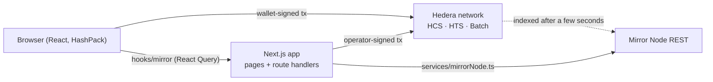
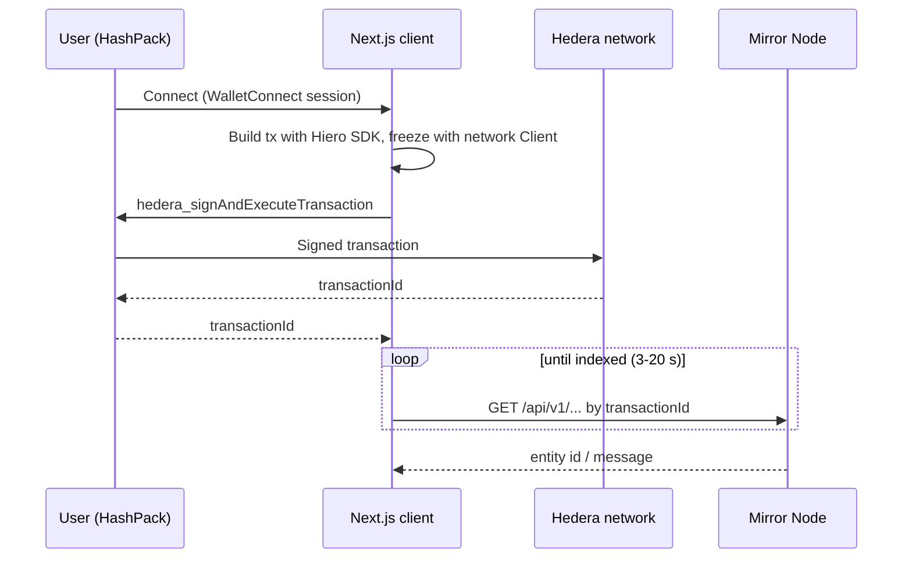
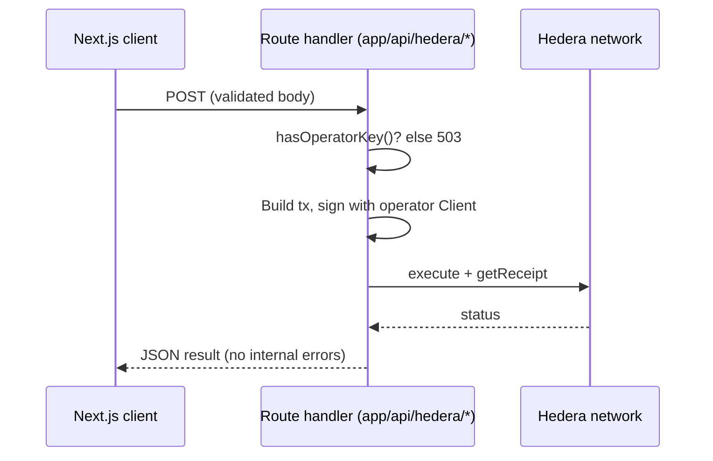
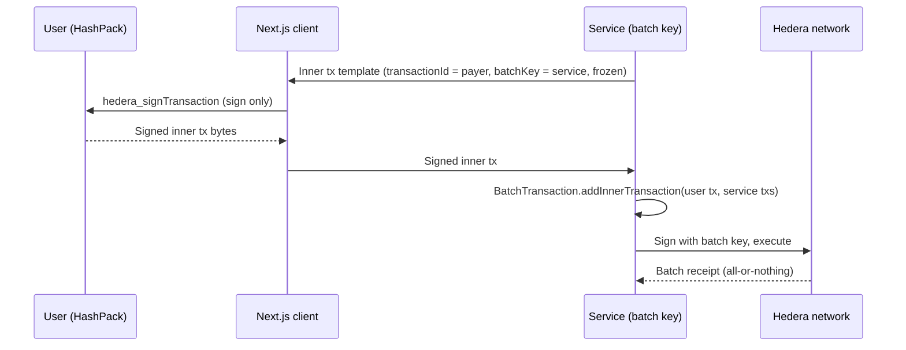

# Architecture

## Overview

This template is a single Next.js (App Router) workspace that talks to Hedera through native services only:

- **Hedera Consensus Service (HCS)** — topics and messages (the Proof Wall feed).
- **Hedera Token Service (HTS)** — fungible badge tokens and airdrops.
- **Mirror Node REST API** — every read: topic messages, accounts, tokens, transactions, schedules.
- **HashPack via WalletConnect** (Reown AppKit + `@hashgraph/hedera-wallet-connect`) — every user-signed write.
- **Hiero SDK** (`@hiero-ledger/sdk`) — builds transactions on the client and on the server.

There is no Solidity workspace and no EVM contract deployment. The only server-side signing happens in Next.js route handlers with an operator key read from the environment.

<!-- TODO(product): add the product-specific flow (governed operations or merchant rails) once the feature set is decided. -->

_Product-specific flows: coming with the first release._



## Signing flows

### User wallet → app → Hedera

The app builds the transaction, freezes it and hands it to HashPack. The user's private key never leaves the wallet.



Code: `services/web3/hederaSigner.ts` (signer), `hooks/useHederaSigner.ts` (session in components), `services/web3/NativeTransactionSignerBridge.tsx` (bridge to `@scaffold-hbar-ui/hooks`), `utils/scaffold-hbar/resolve*` (Mirror polling).

### Operator → server route → Hedera

Actions the application pays for run in a route handler with the operator credentials. The client only calls the route; it never sees the key.



Code: `services/hederaClient.ts`, `app/api/hedera/check-badge/route.ts`, `services/badgeService.ts`.

### Batch of inner transactions with a batch key (HIP-551)

Several transactions execute atomically: either all inner transactions succeed or none do. The service holds the batch key; the user signs only their own inner transaction.



Rules that make this work (verified on testnet):

- Build the inner transaction with `setTransactionId(TransactionId.generate(payer))`, `setBatchKey(serviceKey)`, then `freeze()`.
- Do **not** call `setNodeAccountIds` on an inner transaction: it locks the node list and `freeze()` can no longer pin node `0.0.0`, which batches require.
- The wallet signs the inner transaction with `hedera_signTransaction`; the batch itself is executed by whoever holds the batch key.

## Module map

| Module           | Path (under `packages/nextjs/`)                                                                   | Responsibility                                                                                           |
| ---------------- | ------------------------------------------------------------------------------------------------- | -------------------------------------------------------------------------------------------------------- |
| Wallet signer    | `services/web3/hederaSigner.ts`, `hooks/useHederaSigner.ts`                                       | WalletConnect session, sign-and-execute, sign-only, batch inner-transaction helpers                      |
| Wallet bootstrap | `services/web3/appKitHedera.ts`, `hederaWalletConnect.tsx`, `NativeTransactionSignerBridge.tsx`   | AppKit + `HederaProvider` singletons, session context, bridge to `@scaffold-hbar-ui/hooks`               |
| Mirror client    | `services/mirrorNode.ts`, `hooks/mirror/*`                                                        | Typed REST client (HTTP only) and React Query hooks; all reads go through here                           |
| Swap provider    | `services/swap/*`                                                                                 | `SwapProvider` interface and SaucerSwap V2 implementation — see [Swap provider](#swap-provider)          |
| Operator client  | `services/hederaClient.ts`                                                                        | Server-side `Client` with the operator key; used only by route handlers                                  |
| Setup script     | root `yarn setup`                                                                                 | Idempotent testnet bootstrap: creates missing resources with the operator and writes ids to `.env.local` |
| Harness          | `.harness/`                                                                                       | ASSERT (`validators/static.json`, `yarn.json`), SMOKE (`playwright-smoke.yaml`), EVALUATE (`eval.json`)  |
| Demo             | `app/*`, `components/*`, `hooks/use*.ts`, `services/badgeService.ts`, `config/proofWallConfig.ts` | Proof Wall pages built on the modules above                                                              |

## Verified network constraints and decisions

| Constraint / decision                  | Why                                                                                                                                                                        |
| -------------------------------------- | -------------------------------------------------------------------------------------------------------------------------------------------------------------------------- |
| **Yarn 3.2.3 only**                    | Scaffold-HBAR, `create-scaffold-hbar` and `hedera-harness` assume Yarn workspaces; the harness forbids `npm`/`pnpm` commands and the recipe uses `yarn` verbs              |
| **No Solidity workspace**              | Every feature uses native services; `contracts/deployedContracts.ts` stays empty and `solidityFramework` is `none` in `template.json`                                      |
| **Mirror Node lag**                    | Reads after consensus can 404 or return stale pages for several seconds; every post-write read polls with backoff and the UI shows a "resolving" state                     |
| **Freeze before sign**                 | Wallet signing needs a frozen transaction with a fixed transaction id and node ids; `DAppSigner.freezeWithSigner` does not set node ids, so freeze with a network `Client` |
| **Batch inner txs never set node ids** | `setNodeAccountIds` blocks `freeze()` from pinning node `0.0.0`, which HIP-551 inner transactions require                                                                  |
| **Schedules are indexed by creator**   | Mirror `/schedules?account.id=` filters by `creator_account_id`, and it lists the payer's signature, which does not count toward a threshold key                           |
| **On-chain quoting for swaps**         | SaucerSwap API reserves do not reflect concentrated-liquidity prices; `amountOutMinimum` must come from `QuoterV2` or the pool's `sqrtRatioX96`                            |
| **Setup targets testnet only**         | `yarn setup` spends operator HBAR and creates entities; it refuses other networks so a misconfigured `.env` cannot touch mainnet                                           |
| **Operator key stays server-side**     | Only route handlers read `HEDERA_OPERATOR_*`; the client learns whether an operator exists through `/api/hedera/operator-status`                                           |
| **`.env.example` is the env contract** | `template.json` carries no `envVars` (the CLI would write a root `.env.example` Next.js does not read); every variable is documented in `packages/nextjs/.env.example`     |

## Swap provider

`packages/nextjs/services/swap/` is the app's only contact with a DEX. Everything else talks to the `SwapProvider` type in `types.ts`:

```ts
quote({ tokenIn, tokenOut, amountIn }); // → { amountOut, amountOutMinimum, route }
buildSwapStep({ tokenIn, tokenOut, amountIn, amountOutMinimum, recipient, deadline }); // → ContractExecuteTransaction
```

Amounts are `bigint` in the smallest unit of each token (tinybar for HBAR). Tokens are Hedera ids wrapped in a small union, `HBAR` or `htsToken("0.0.x")`, so "native HBAR" is a typed value and never a magic string. `buildSwapStep` returns a built transaction that is not frozen, signed or executed: the caller decides whether it goes through the wallet, the server operator or as an inner transaction of an atomic batch. The DEX pays `tokenOut` straight to `recipient`, so settlement never passes through a contract of ours.

**Why an interface**

The DEX is load-bearing (there is no "pay in HBAR, receive USDC" without one) and at the same time the part most likely to change: a different DEX, a different fee tier, a router upgrade, or mainnet versus testnet. Keeping it behind `SwapProvider` lets the rest of the app and its tests depend on a two-method contract instead of on SaucerSwap's ABI, addresses or quoting quirks. The one implementation today is `SaucerSwapV2Provider` (`saucerSwapV2Provider.ts`); `createSwapProvider(network)` in `createSwapProvider.ts` picks it and wires the network-specific pieces.

**Quoting on-chain, and the `Too little received` lesson**

SaucerSwap V2 is a concentrated-liquidity AMM (Uniswap V3 model). The pool reserves published by its REST API are not the executable price: the first swap built from them reverted in the router with `Too little received`, because the real output was below the `amountOutMinimum` derived from those reserves. The provider therefore quotes on-chain with `QuoterV2.quoteExactInputSingle`, read through a gas-free `eth_call` on the JSON-RPC relay (`jsonRpcQuoter.ts`). The quoter simulates the exact swap the router will run, so `amountOut` is the executable amount and `amountOutMinimum = amountOut × (10000 − slippageBps) / 10000` (integer math, `slippage.ts`) is a meaningful floor. Slippage defaults to `DEFAULT_SLIPPAGE_BPS` (50 bps) and is a constructor option.

The quoter and the swap share the same inputs on purpose (`tokenIn`, `tokenOut`, `fee`, `amountIn`, no `sqrtPriceLimitX96`): anything that changes one must change the other, or the quote stops describing the swap.

**Hedera-specific traps the provider absorbs**

- **HBAR in.** The router only knows the WHBAR token. HBAR is passed as the transaction's payable amount, `tokenIn` is encoded as WHBAR and the router wraps it. HBAR is accepted as `tokenIn` only; to receive HBAR, ask for the WHBAR token as `tokenOut`.
- **Recipient address.** An account created from an ECDSA key has an EVM alias. HTS transfers to that account's long-zero address (`0x…<account num>`) revert inside the router with HTS code `282 INVALID_ALIAS_KEY`. `buildSwapStep` takes the recipient as a Hedera id and resolves the address the network knows it by through Mirror Node (`accountResolver.ts`), which returns the alias when there is one and the long-zero address otherwise.
- **HTS in.** With an HTS `tokenIn` there is no payable amount: the router pulls the tokens, so the payer must have granted it an allowance beforehand (`AccountAllowanceApproveTransaction`). The module builds the swap only; the HTS-in path has not been exercised on testnet yet.
- **Failure mode.** Minimum output and deadline are validated before encoding and enforced by the router, so a stale quote fails the transaction instead of settling at a worse price. Inside an atomic batch that failure reverts the whole batch.

**Testing without the network**

The two network reads are injected: `SaucerSwapQuoter` (the quoter call) and `AccountResolver` (the Mirror Node lookup). Unit tests pass mocks for both and assert the calldata against a vector encoded independently with ethers, the slippage boundaries, the validation errors and the payable amount. `createSwapProvider` is the only place that builds the real JSON-RPC and Mirror Node implementations.

**Adding another DEX**

1. Add `services/swap/<dex>Config.ts` with every contract id, token id and fee tier per network (`testnet`, `mainnet`), verified against Mirror Node.
2. Implement `SwapProvider` in `services/swap/<dex>Provider.ts`. Keep the ABI in one file, quote on-chain, keep the price and slippage math in pure functions and inject any network read so tests stay offline.
3. Register it in `PROVIDER_FACTORIES` in `createSwapProvider.ts` and extend the `SwapDex` union; callers select it with `createSwapProvider(network, { dex })`.
4. Verify one real swap on testnet with the final code and note the transaction in the pull request.
