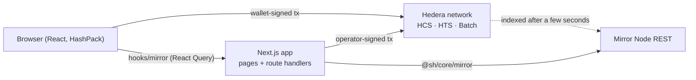
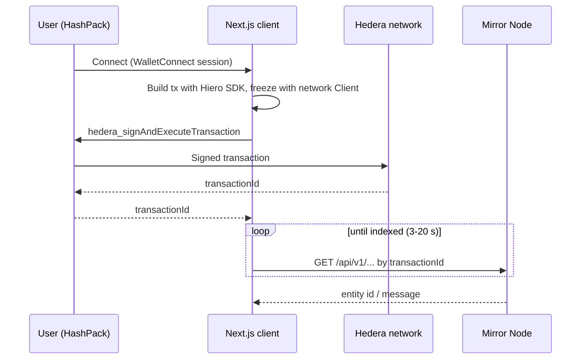
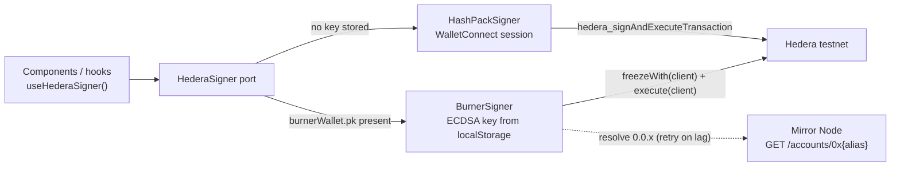
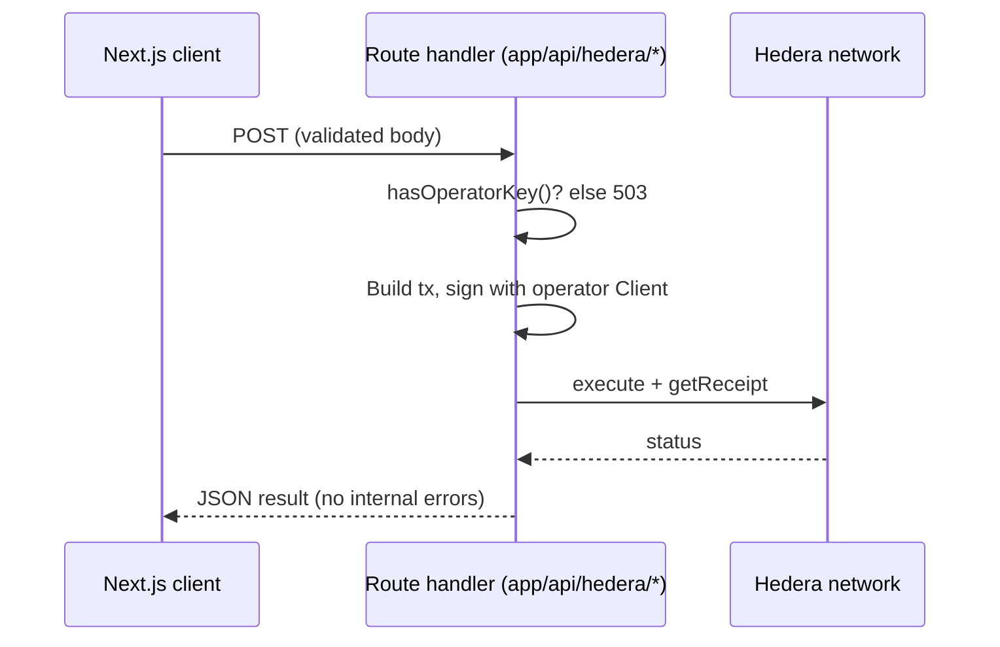
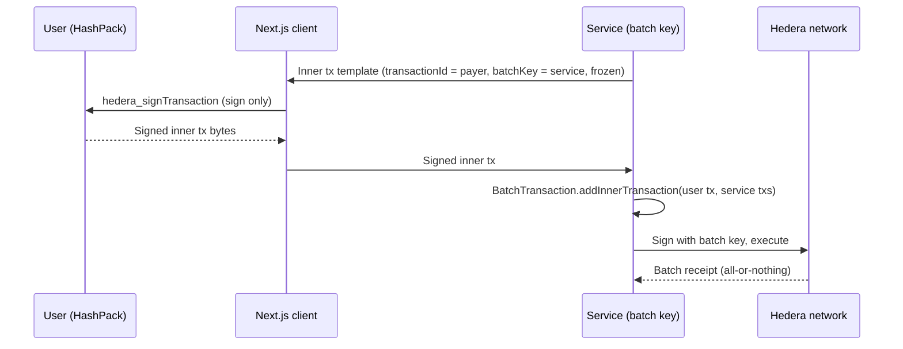
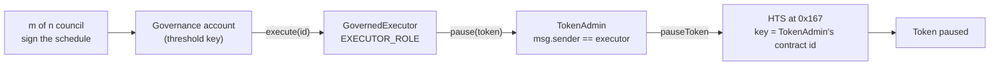
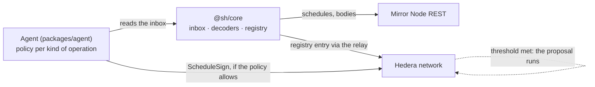

# Architecture

## Overview

This template is a Next.js (App Router) app over a framework-free domain workspace, talking to Hedera through native services only:

- **Hedera Consensus Service (HCS)** — topics and messages (the Proof Wall feed).
- **Hedera Token Service (HTS)** — fungible badge tokens and airdrops.
- **Mirror Node REST API** — every read: topic messages, accounts, tokens, transactions, schedules.
- **HashPack via WalletConnect** (Reown AppKit + `@hashgraph/hedera-wallet-connect`) — every user-signed write.
- **Test signer** — a disposable ECDSA key injected by Hedera Harness (`localStorage["burnerWallet.pk"]`) that signs in place of HashPack during automated validation; same port, see [Signing port](#signing-port-hashpack-or-test-signer).
- **Hiero SDK** (`@hiero-ledger/sdk`) — builds transactions on the client and on the server.

The governance domain and the Mirror Node client live in `packages/core` (`@sh/core`), which imports no React and no `scaffold.config.ts`: the app is one consumer of it and the co-signing agent in `packages/agent` is another — see [The co-signing agent](#the-co-signing-agent). The dependency runs one way — the app imports the domain, never the reverse. Contracts live in `packages/hardhat` and reach the network through the Hedera JSON-RPC relay, not the Hiero SDK. Server-side signing happens in Next.js route handlers with an operator key read from the environment, and at deploy time with the encrypted deployer key in `packages/hardhat/.env`.

<!-- TODO(product): add the product-specific flow (governed operations or merchant rails) once the feature set is decided. -->

_Product-specific flows: coming with the first release._



## Signing flows

### User wallet → app → Hedera

The app builds the transaction, freezes it and hands it to HashPack. The user's private key never leaves the wallet.



Code: `services/web3/hederaSigner.ts` (wallet calls), `services/web3/hashPackSigner.ts` (port adapter), `hooks/useHederaSigner.ts` (signer in components), `services/web3/NativeTransactionSignerBridge.tsx` (bridge to `@scaffold-hbar-ui/hooks`), `utils/scaffold-hbar/resolve*` (Mirror polling).

### Signing port: HashPack or test signer

Components sign through one port, `HederaSigner` (`services/web3/hederaSignerPort.ts`): `executeTransaction(tx)` and `signTransaction(tx)` plus `kind`, `accountId` and `network`. Two adapters implement it, and `useHederaSigner` picks one per page load:



- **Selection** (`BurnerSignerProvider`): on load the app reads `localStorage["burnerWallet.pk"]`. If a key is present, allowed by `burnerSignerPolicy.ts` (testnet only; in production builds only with `NEXT_PUBLIC_ENABLE_BURNER_SIGNER=true`) and its account resolves on the Mirror Node, the burner becomes the active signer and takes precedence over any HashPack session. Otherwise HashPack is used and the header offers "Connect Wallet".
- **Why**: Hedera Harness CHAIN provisions a funded ECDSA account and injects its key that way, following the burner-wallet pattern of the harness's x402 recipe ([hedera-dev/hedera-harness](https://github.com/hedera-dev/hedera-harness)). HashPack cannot be driven by Playwright, so without this port wallet-gated assertions could only be graded as affordances.
- **UI**: the header shows the burner's `0.0.x` with a "test signer" badge; "Disconnect" forgets the key. Consumers read the payer with `requireAccountId()` and never touch the wallet provider directly, so they do not care which signer is active.
- **Extension point**: `BurnerSigner.publicKey` lets a demo mode put the ephemeral account on-chain beyond paying (for example as a member of a threshold key); a payer-only demo needs nothing beyond the HBAR the harness funds (`chainValidation.fundingHbar`).

### Operator → server route → Hedera

Actions the application pays for run in a route handler with the operator credentials. The client only calls the route; it never sees the key.



Code: `services/hederaClient.ts`, `app/api/hedera/check-badge/route.ts`, `services/badgeService.ts`.

### Batch of inner transactions with a batch key (HIP-551)

Several transactions execute atomically: either all inner transactions succeed or none do. The service holds the batch key; the user signs only their own inner transaction.



Rules that make this work (verified on testnet):

- Build the inner transaction with `setTransactionId(TransactionId.generate(payer))`, `setBatchKey(serviceKey)`, then `freeze()`.
- Do **not** call `setNodeAccountIds` on an inner transaction: it locks the node list and `freeze()` can no longer pin node `0.0.0`, which batches require.
- The wallet signs the inner transaction with `hedera_signTransaction`; the batch itself is executed by whoever holds the batch key.

## Module map

| Module           | Path (`@sh/core/…` in the shared workspace, otherwise under `packages/nextjs/`)                                                                                                                              | Responsibility                                                                                           |
| ---------------- | ------------------------------------------------------------------------------------------------------------------------------------------------------------ | -------------------------------------------------------------------------------------------------------- |
| Signing port     | `services/web3/hederaSignerPort.ts`, `hashPackSigner.ts`, `burnerSigner.ts`, `burnerSignerPolicy.ts`, `BurnerSignerProvider.tsx`, `hooks/useHederaSigner.ts` | `HederaSigner` port, HashPack and test-signer adapters, selection policy and context                     |
| Wallet signer    | `services/web3/hederaSigner.ts`                                                                                                                              | WalletConnect calls: sign-and-execute, sign-only, batch inner-transaction helpers                        |
| Wallet bootstrap | `services/web3/appKitHedera.ts`, `hederaWalletConnect.tsx`, `NativeTransactionSignerBridge.tsx`                                                              | AppKit + `HederaProvider` singletons, session context, bridge to `@scaffold-hbar-ui/hooks`               |
| Mirror client    | `@sh/core/mirror`, `hooks/mirror/*`                                                                                                                   | Typed REST client (HTTP only) and React Query hooks; all reads go through here                           |
| Proposals        | `@sh/core/governance/schedules`                                                                                                                           | A proposal as a scheduled transaction: create with the governance account as payer, sign, withdraw |
| Council          | `@sh/core/governance/council`, `hooks/mirror/useCouncil.ts`                                                                                               | Who approves (the threshold key) and who may propose (`PROPOSER_ROLE`), read from the ledger |
| Proposal inbox   | `@sh/core/governance/proposals`, `hooks/mirror/useProposals.ts`                                                                                           | The council's open proposals and each one's progress — see [The proposal inbox](#the-proposal-inbox) |
| Proposal kinds   | `@sh/core/governance/proposalTypes`, `encode`, `decode`                                                                                             | The five kinds: form values to transactions, and a scheduled body back to a described operation — see [Reading a proposal](#reading-a-proposal-two-layers) |
| Proposal registry | `@sh/core/governance/registry`                                                                                                                           | `GovernedExecutor`: the entry behind a proposal, retiring one, and the id a registration returned |
| Co-signing agent | `packages/agent/*`                                                                                                                                           | One seat on the council, signing under a written policy — see [The co-signing agent](#the-co-signing-agent) |
| Swap provider    | `services/swap/*`                                                                                                                                            | `SwapProvider` interface and SaucerSwap V2 implementation — see [Swap provider](#swap-provider)          |
| Operator client  | `services/hederaClient.ts`                                                                                                                                   | Server-side `Client` with the operator key; used only by route handlers                                  |
| Setup script     | root `yarn setup`                                                                                                                                            | Idempotent testnet bootstrap: creates missing resources with the operator and writes ids to `.env.local` |
| Harness          | `.harness/`                                                                                                                                                  | ASSERT (`validators/static.json`, `yarn.json`), SMOKE (`playwright-smoke.yaml`), EVALUATE (`eval.json`)  |
| Demo             | `app/*`, `components/*`, `hooks/use*.ts`, `services/badgeService.ts`, `config/proofWallConfig.ts`                                                            | Proof Wall pages built on the modules above                                                              |

## Verified network constraints and decisions

| Constraint / decision                  | Why                                                                                                                                                                        |
| -------------------------------------- | -------------------------------------------------------------------------------------------------------------------------------------------------------------------------- |
| **Yarn 3.2.3 only**                    | Scaffold-HBAR, `create-scaffold-hbar` and `hedera-harness` assume Yarn workspaces; the harness forbids `npm`/`pnpm` commands and the recipe uses `yarn` verbs              |
| **Two write paths**                    | Native services go through the Hiero SDK; contracts go through the JSON-RPC relay from `packages/hardhat`, and each deploy regenerates `contracts/deployedContracts.ts`   |
| **Mirror Node lag**                    | Reads after consensus can 404 or return stale pages for several seconds; every post-write read polls with backoff and the UI shows a "resolving" state                     |
| **Freeze before sign**                 | Wallet signing needs a frozen transaction with a fixed transaction id and node ids; `DAppSigner.freezeWithSigner` does not set node ids, so freeze with a network `Client` |
| **Batch inner txs never set node ids** | `setNodeAccountIds` blocks `freeze()` from pinning node `0.0.0`, which HIP-551 inner transactions require                                                                  |
| **HTS keys can be a contract id**       | A council cannot sign an HTS operation: scheduling one is refused outright and a scheduled contract call cannot present the governance key to `0x167`. The token's keys point at `TokenAdmin` instead — see [Governing an HTS token](#governing-an-hts-token-the-contract-as-the-tokens-key) |
| **Schedules are indexed by creator**   | Mirror `/schedules?account.id=` filters by `creator_account_id`, and it lists the payer's signature, which does not count toward a threshold key                           |
| **The proposer withdraws a proposal**  | A schedule is deletable only through an admin key fixed at creation, and that key must sign the creation — so it is the proposer's, not the council's. See [Withdrawing a proposal](#withdrawing-a-proposal-schedule-or-registry) |
| **On-chain quoting for swaps**         | SaucerSwap API reserves do not reflect concentrated-liquidity prices; `amountOutMinimum` must come from `QuoterV2` or the pool's `sqrtRatioX96`                            |
| **Test signer is testnet-only**        | The burner signs with a key stored in the browser; `burnerSignerPolicy.ts` ignores it on mainnet and, in production builds, unless `NEXT_PUBLIC_ENABLE_BURNER_SIGNER=true` |
| **Setup targets testnet only**         | `yarn setup` spends operator HBAR and creates entities; it refuses other networks so a misconfigured `.env` cannot touch mainnet                                           |
| **Operator key stays server-side**     | Only route handlers read `HEDERA_OPERATOR_*`; the client learns whether an operator exists through `/api/hedera/operator-status`                                           |
| **`.env.example` is the env contract** | `template.json` carries no `envVars` (the CLI would write a root `.env.example` Next.js does not read); every variable is documented in `packages/nextjs/.env.example`     |

## Governing an HTS token: the contract as the token's key

Pausing a token or freezing an account is a native HTS operation, and a council that holds a
threshold key cannot perform one directly. Two obvious routes fail, each with its own network error,
and the one that works reads like a detour until you see why the other two do not.

**A scheduled `TokenPause` is rejected outright.** Scheduled transactions are limited to a whitelist
set by the network's configuration, and the token operations are not on it:

```
SCHEDULED_TRANSACTION_NOT_IN_WHITELIST
```

**A scheduled contract call with the key on the governance account is rejected by the system
contract.** The obvious repair is to wrap the operation in a contract call, which *is* schedulable,
and leave the token's pause key on the governance account. The schedule collects the m signatures,
executes, and the call reaches HTS at `0x167` — which refuses it:

```
INVALID_FULL_PREFIX_SIGNATURE_FOR_PRECOMPILE
```

The system contract verifies a key by looking for a signature over the transaction carrying a full
public-key prefix. The signatures a schedule collects belong to the scheduled transaction and are
not presented to the system contract in that form, so from inside `0x167` the governance account's
key is simply not there — no matter how many council members signed.

**What works is making the contract itself the key.** A Hedera token key can be a *contract id*, and
the network grants that key to whoever is executing that contract's code. So the token's pause and
freeze keys are set to `TokenAdmin`'s contract id, and `TokenAdmin` accepts calls only from the
executor — whose `execute` is reachable only after m of n council members sign. Authority stops
being something a signature proves to HTS and becomes something the call path proves.



What `0x167` checks is its **immediate caller**, the contract whose code is running when it is
called — not the payer and not the rest of the chain. That is why the extra hop through the executor
changes nothing, and it is also the pattern's one hard rule: reaching HTS through a `delegatecall`
would present the *calling* contract instead, and the key would have to be declared as a
`delegatableContractId` for that to be accepted.

**Freezing acts on a relationship, not on a token.** `freeze` names a token *and* an account, and
the two must already be associated. Freezing an account that never associated the token answers:

```
TOKEN_NOT_ASSOCIATED_TO_ACCOUNT  (184)
```

Association is the receiving account's own act — a contract deployed through the JSON-RPC relay gets
unlimited automatic associations, while an account created through the SDK gets none unless asked
for them. Whoever the demo freezes has to hold the token first.

**HTS answers with a code; `TokenAdmin` turns a refusal into a revert.** The system contract reports
failure by returning a response code, not by reverting, so a contract that ignores it would let a
refused operation finish as a successful transaction: the proposal would be marked executed and the
scheduled transaction carrying the council's approval would be spent on nothing. `TokenAdmin`
reverts with `HtsRejected(responseCode)` instead, which leaves the proposal pending and
reschedulable once the cause is fixed, and carries the code out to the Mirror Node for the UI to
explain.

**The keys are permanent, and that is a choice.** A token created without an admin key can never
have its keys changed, so its pause and freeze keys point at that one `TokenAdmin` deployment
forever: redeploying the contract means the token is administered by the old one, and there is no
way back. This template takes that deliberately — the point is that governance cannot be walked
back — but a deployment that needs an escape hatch gives the token an admin key held by the same
contract and an operation to re-point the keys, which is one more governed operation, not a
loophole.

**Cost.** Measured on testnet through the full chain, each operation consumes 65k–68k gas, refusals
included, which puts the schedule's gas limit at 90,000. The limit is a price, not a ceiling (see
the table above), so it belongs to the operation: a token-admin proposal is not an upgrade (99k) and
not a swap (241k).

## The proposal inbox

Listing what the council has open runs into a Mirror Node constraint: `GET /schedules?account.id=X`
matches the **creator** of a schedule, never its payer. A proposal is defined by its payer — the
governance account — so there is no single query that returns them. The list is assembled the other
way round: ask the executor who holds `PROPOSER_ROLE`, read the schedules each of them created, and
keep the ones the governance account pays for.

Reading the role needs `AccessControlEnumerable` rather than plain `AccessControl`, which only
answers whether a given account holds a role. It goes through the JSON-RPC relay, because the
browser has no operator key to sign a `ContractCallQuery` with. The role stores EVM addresses while
Mirror wants `0.0.x` ids, and an account created from an ECDSA key is reached by a key-derived alias
rather than by the long-zero form of its id, so each address is resolved through the Mirror Node.

**The blind spot this leaves, accepted and mitigated.** A native proposal needs no `PROPOSER_ROLE`:
anyone can open a schedule the governance account pays for. Such a proposal is not in the list. It
is not a security hole — without the threshold it cannot run, and the payer's key is what gates the
spending — and any proposal remains inspectable by its schedule id.

One proposer Mirror cannot be read for yields a partial list naming that proposer, rather than an
empty screen: with several proposers, a transient failure on one should not hide the rest.

### Counting approvals, not signatures

`m of n` cannot be read off `signatures.length`. Mirror records a signature row for every key that
signed any transaction touching the schedule, and two kinds of row never count toward the threshold:
the one `ScheduleCreate` adds for whoever paid to open the proposal, and the one every
`ScheduleSign` adds for whoever paid to submit it. Measured on testnet, an executed 2-of-3 proposal
shows **four** rows — two council members, and the payer twice.

The rule that survives this is to count **council members, not rows**: a member is in or out however
many rows carry its key. It also gets right the case the demo runs on, where the same person opens a
proposal and approves it — there the creator's signature counts, once, because the creator holds a
seat. Treating every creator signature as noise would show `0 of 2` for a proposal that really has
one approval.

The members come from the governance account's key, read from the ledger rather than from
configuration: rotating the council is itself a proposal, so a value in the environment would start
lying the moment one passed. Mirror returns that key as `ProtobufEncoded`, an opaque blob, so
decoding it uses `@hiero-ledger/proto` — the package the Hiero SDK already ships, which is why it
adds nothing to the bundle. Matching a signature to a member happens in hex, since
`public_key_prefix` is a prefix and base64 packs three bytes into four characters.

**Two records of the same proposal.** The schedule's own state — pending, executed, deleted or
expired — does not know whether the registry entry behind it was cancelled on its own, which leaves
a schedule that still looks open. Telling the two apart needs the proposal id, which is inside the
scheduled transaction body: see [Reading a proposal](#reading-a-proposal-two-layers).

## Reading a proposal: two layers

A schedule carries its payload as a base64 `SchedulableTransactionBody`. Without decoding it the
council is asked to approve a blob, so the inbox and the detail screen decode every body they list.

Two of the five kinds are readable straight from that body. A treasury transfer is a
`CryptoTransfer` and a council rotation a `CryptoUpdate` on the governance account itself, and both
are on the scheduling whitelist, so the council approves the operation directly. The other three —
upgrade, treasury swap and token administration — are a `ContractCall` to `execute(id)`, which names
only the registry entry that holds the real operation. Describing one of those takes a second step:
read `proposal(id)` from `GovernedExecutor` through the relay and decode the call it stores.

That second read is also the cross-check. `proposal(id)` returns the target, the stored calldata and
the state in one answer, so asking what a proposal does and asking whether it is still alive are the
same relay call, made once per pending proposal.

**Nothing throws on a body it does not understand.** Anyone can open a schedule the governance
account pays for, so the inbox will meet bodies that are none of the five kinds. Every failure comes
back as an `unrecognized` result carrying the reason, for the screen to show beside the raw body,
because a decoder that threw on one row would take the whole list down with it. The same holds a
layer down: a registry entry may store a call to any target, which is the point of a general
registry, and one whose selector matches nothing here is shown with its target and calldata rather
than hidden.

**And a field the decoder does not read makes the body unrecognised.** That is what lets the decoded
body be the evidence the memo is not. Matching a selector says nothing about the argument behind it,
and `CryptoUpdate` carries around twenty fields besides the key — the account's own expiry, its
automatic association slots, its staking — so a rotation that quietly also set one of those would be
approved as "changes who approves". The bodies that can carry more than one operation are checked by
re-encoding what was understood and comparing it against what arrived.

**An entity named by an address stays an address.** A contract or an account can arrive as an EVM
address or a key alias rather than a number, and converting one to the other needs the Mirror Node.
Reading only the number would render every one of them as `0.0.0`, which is a real account and the
wrong one, so the address is carried through and the cross-check matches a contract in either form.

**The memo is never read back.** It is free text written by whoever opened the proposal, so it can
say "upgrade" over a body that moves the treasury somewhere else. It is a label for a human scanning
HashScan, and the decoded body is the evidence.

**A selector names an operation; it does not prove a target.** The decoder classifies by function
selector alone, so the target always travels with the answer. Gating on it — refusing to approve a
call to an unknown contract — is the co-signing agent's job, not the decoder's.

### A rotation collects signatures from two councils

Changing who approves is itself a proposal, and it is the one kind whose progress is not a single
`m of n`. Measured on testnet: a scheduled `AccountUpdate` that replaces a threshold key does not run
on the outgoing council's threshold alone — the schedule stays pending — and runs once the incoming
key's own threshold is also met. Each side needs its own threshold rather than all of its members,
so a 2-of-3 council rotating to another 2-of-3 needs four signatures in total, two from each.

The incoming council comes out of the decoded body in the same shape `fetchCouncilKey` returns for
the current one, so `countThresholdSignatures` runs over both: a rotation's row carries `progress`
against the council that exists and `incomingProgress` against the one it proposes, and every other
kind carries `null` for the second. Rendering the two is the inbox screen's job.

## Withdrawing a proposal: schedule or registry

A pending proposal exists twice — as an entry in `GovernedExecutor` and as the scheduled transaction
the council signs — and each one is retracted differently.

**The schedule.** Hedera deletes a schedule only through an admin key fixed when the schedule is
created; without one, `ScheduleDelete` comes back `SCHEDULE_IS_IMMUTABLE` and the only way out is
waiting for the expiry. And naming a key that does not sign the `ScheduleCreate` fails with
`INVALID_SIGNATURE`, which settles whose key it is: the governance account's threshold key in that
slot would make opening a proposal an m-of-n vote of its own, so the admin key is the proposer's own
key, read from the Mirror Node at creation time (`fetchAccountPublicKey`). Deleting ends **one round
of approval**: the registry entry stays pending and anyone may schedule `execute(id)` again.

**The registry.** `cancel(id)` ends the proposal itself, and the proposer can call it directly — no
schedule, no quorum — because the contract grants cancellation to the proposer and to the governance
account. For the council, cancelling is a proposal like any other.

The two have to move in that order. A schedule left alive for an already cancelled proposal is a
trap: when its threshold is reached, `execute` reverts with `ProposalNotPending` and the governance
account pays for the gas the revert consumed. So the app deletes the schedule first and cancels
afterwards. A native proposal — rotating the council through an `AccountUpdate` — has no registry
entry at all, and there the delete is the only retraction there is.

## What a redeploy repairs, and what it does not

Every contract here trusts `GovernedExecutor`, and redeploying it splits them in two. `TokenAdmin`
and `SaucerSwapAdapter` take the executor as a **constructor argument**, so the same
`yarn hardhat:deploy` that produced a new executor also produces new ones pointing at it: the
binding is recreated, and nothing has to be checked. `AcmeVault` does not. Its executor is set in
`initialize`, the state lives in the proxy rather than in the implementation, and there is no setter
— by design, since a vault that can be re-pointed at another executor is a vault whose governance
can be swapped out. So a redeployed executor leaves the proxy trusting an address that no longer
runs anything, and hardhat-deploy has no reason to notice: the proxy is still deployed.

Two more bindings cannot be repaired at all. The demo token's pause and freeze keys are
`TokenAdmin`'s contract id and the token has no admin key, so a redeployed `TokenAdmin` orphans the
token for good; the governance account's threshold key cannot be replaced without a transaction the
council itself signs, so a changed `HEDERA_COUNCIL_ACCOUNT_ID` means a new account.

What makes these worth naming is that they fail late. Nothing rejects a proposal aimed at a stale
vault: it is registered, the council signs the schedule, the schedule is spent, and the call reverts
with `NotExecutor` at the very end. `yarn setup` therefore reads both permanent bindings back from
the chain before it uses them — the token's pause key from consensus, the vault's `executor()`
through the relay — and stops with the recovery in the message. They are different recoveries:
the vault is redeployed against the current executor (its deployment records removed first), while
an orphaned token is replaced by a new one and left on testnet, unusable.

## Swap provider

`packages/nextjs/services/swap/` is the app's only contact with a DEX. Everything else talks to the `SwapProvider` type in `types.ts`:

```ts
quote({ tokenIn, tokenOut, amountIn }); // → { amountOut, amountOutMinimum, route }
buildSwapStep({
  tokenIn,
  tokenOut,
  amountIn,
  amountOutMinimum,
  recipient,
  deadline,
}); // → ContractExecuteTransaction
```

Amounts are `bigint` in the smallest unit of each token (tinybar for HBAR). Tokens are Hedera ids wrapped in a small union, `HBAR` or `htsToken("0.0.x")`, so "native HBAR" is a typed value and never a magic string. `buildSwapStep` returns a built transaction that is not frozen, signed or executed: the caller decides whether it goes through the wallet, the server operator or as an inner transaction of an atomic batch. The DEX pays `tokenOut` straight to `recipient`, so settlement never passes through a contract of ours.

**Why an interface**

The DEX is load-bearing (there is no "pay in HBAR, receive USDC" without one) and at the same time the part most likely to change: a different DEX, a different fee tier, a router upgrade, or mainnet versus testnet. Keeping it behind `SwapProvider` lets the rest of the app and its tests depend on a two-method contract instead of on SaucerSwap's ABI, addresses or quoting quirks. The one implementation today is `SaucerSwapV2Provider` (`saucerSwapV2Provider.ts`); `createSwapProvider(network)` in `createSwapProvider.ts` picks it and wires the network-specific pieces.

**Quoting on-chain, and the `Too little received` lesson**

SaucerSwap V2 is a concentrated-liquidity AMM (Uniswap V3 model). The pool reserves published by its REST API are not the executable price: the first swap built from them reverted in the router with `Too little received`, because the real output was below the `amountOutMinimum` derived from those reserves. The provider therefore quotes on-chain with `QuoterV2.quoteExactInputSingle`, read through a gas-free `eth_call` on the JSON-RPC relay (`jsonRpcQuoter.ts`). The quoter simulates the exact swap the router will run, so `amountOut` is the executable amount and `amountOutMinimum = amountOut × (10000 − slippageBps) / 10000` (integer math, `slippage.ts`) is a meaningful floor. Slippage defaults to `DEFAULT_SLIPPAGE_BPS` (50 bps) and is a constructor option.

The quoter and the swap share the same inputs on purpose (`tokenIn`, `tokenOut`, `fee`, `amountIn`, no `sqrtPriceLimitX96`): anything that changes one must change the other, or the quote stops describing the swap.

**Hedera-specific traps the provider absorbs**

- **HBAR in.** The router only knows the WHBAR token. HBAR is passed as the transaction's payable amount, `tokenIn` is encoded as WHBAR and the router wraps it. HBAR is accepted as `tokenIn` only; to receive HBAR, ask for the WHBAR token as `tokenOut`.
- **Recipient address.** An account created from an ECDSA key has an EVM alias. HTS transfers to that account's long-zero address (`0x…<account num>`) revert inside the router with HTS code `282 INVALID_ALIAS_KEY`. `buildSwapStep` takes the recipient as a Hedera id and resolves the address the network knows it by through Mirror Node (`accountResolver.ts`), which returns the alias when there is one and the long-zero address otherwise.
- **HTS in.** With an HTS `tokenIn` there is no payable amount: the router pulls the tokens, so the payer must have granted it an allowance beforehand (`AccountAllowanceApproveTransaction`). The module builds the swap only; the HTS-in path has not been exercised on testnet yet.
- **Failure mode.** Minimum output and deadline are validated before encoding and enforced by the router, so a stale quote fails the transaction instead of settling at a worse price. Inside an atomic batch that failure reverts the whole batch.

**Testing without the network**

The two network reads are injected: `SaucerSwapQuoter` (the quoter call) and `AccountResolver` (the Mirror Node lookup). Unit tests pass mocks for both and assert the calldata against a vector encoded independently with ethers, the slippage boundaries, the validation errors and the payable amount. `createSwapProvider` is the only place that builds the real JSON-RPC and Mirror Node implementations.

**Adding another DEX**

1. Add `services/swap/<dex>Config.ts` with every contract id, token id and fee tier per network (`testnet`, `mainnet`), verified against Mirror Node.
2. Implement `SwapProvider` in `services/swap/<dex>Provider.ts`. Keep the ABI in one file, quote on-chain, keep the price and slippage math in pure functions and inject any network read so tests stay offline.
3. Register it in `PROVIDER_FACTORIES` in `createSwapProvider.ts` and extend the `SwapDex` union; callers select it with `createSwapProvider(network, { dex })`.
4. Verify one real swap on testnet with the final code and note the transaction in the pull request.

## The co-signing agent

`packages/agent` is a service that holds **one of the council's n keys** and signs the proposals a
written policy allows. It cannot act alone: whatever it approves still needs the rest of the
threshold from humans, which is what separates an approver from an owner. What it removes is the
waiting — a routine proposal inside written limits gets its second signature in seconds, and one
outside them gets a refusal with the limit it failed named in the log.

It is the reason `packages/core` exists. Deciding whether to sign means decoding the scheduled body
and reading the registry entry behind it, which is exactly what the app's proposal screens do; a
copy of that logic in a service would be a second answer to "what is the council being asked to
approve", and the two would drift. The agent imports the same `fetchProposalInbox`,
`decodeScheduledOperation` and `fetchRegistryEntries` the UI renders from.



Three design decisions are load-bearing, and all three are about what the agent refuses:

- **The policy fails closed.** A kind of operation with no rule is refused rather than allowed, so a
  policy written for treasury transfers has not silently authorised contract upgrades, and a sixth
  kind added to the template is refused by every policy written before it existed.
- **A council rotation is never signed automatically**, and the policy format has no field that
  could change it. It is the operation that decides who governs, the agent's own seat included.
- **Anything unreadable is refused**, not skipped: a body that did not decode, a registry entry that
  is missing or cancelled, an entry the relay could not be asked for, a call to another executor. An
  approver that cannot tell what it is approving has exactly one safe answer.

One trap is worth recording because it only appears against a live network. Mirror lags consensus by
a few seconds and the agent polls faster than that, so a signature it has just sent is still absent
from the schedule on the next pass and the proposal reads as pending and unsigned. Measured on
testnet: without a memory of what this process has already signed, the agent signs the same proposal
again and the receipt comes back `SCHEDULE_ALREADY_EXECUTED` — one wasted fee per pass until Mirror
catches up, and a duplicate `ScheduleSign` on any proposal still short of its threshold.

### Release manifests

An upgrade proposal names an implementation address, and an address on its own is unanswerable: the
council can read it and cannot read what is at it. An allowlist in the agent's policy only moves the
question to whoever edits the policy — it says an address is blessed, never that the code still
sitting there is the build that was blessed.

A release manifest closes that. At release time `yarn release:publish` submits, to the HCS topic
`yarn setup` created, a record of `{version, contract, implementation, bytecodeHash, commit,
publishedAt}`; the hash is keccak256 of the **runtime bytecode the Mirror Node reports** for that
address. Before signing an upgrade the agent fetches the deployed code for the proposed
implementation, hashes it the same way, and looks for a manifest that names the address *and*
matches the hash. Three outcomes, all verified on testnet:

| | |
| --- | --- |
| deployed code matches a release | signed, with the version in the reason |
| no release names the address | refused |
| a release names it and the code does not match | refused, quoting both hashes |

Hashing what the network reports, on both sides, is what makes this work at all. The local artifact's
`deployedBytecode` differs from the deployed code — immutable variables and the metadata suffix are
settled at deploy time — so a publisher that hashed the artifact would produce manifests nothing ever
matched. It also makes the check repeatable by hand: read the topic on HashScan, take the
`bytecodeHash`, and compare it against `GET /contracts/{id}` for the address.

What a manifest does not attest is the source. That is Sourcify's job, and the two compose: Sourcify
says the source matches the deployed code, the manifest says the deployed code is the build the team
published for this version.

Custody in the demo is a private key in the environment, which is right for a testnet fixture and
wrong for anything else. Signing is a single injected function (`SignSchedule`), so a real seat
moves behind an HSM or a custody provider without touching the policy or the review loop. The seat
is revocable the same way any other governance change happens: the council rotates its threshold key
to drop the agent's member key, which is a proposal the humans approve and the agent will not sign
for them.
